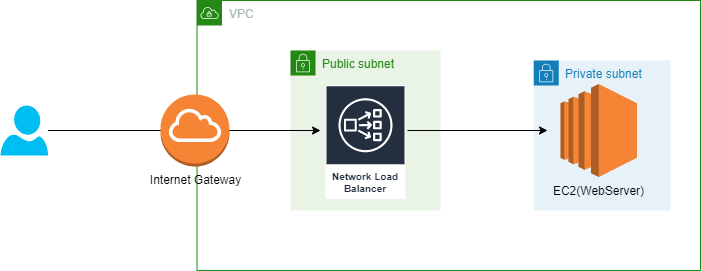

# WAWA Assessment

## Architecture 


## Tools used:
- Terraform
- Ansible

## How to provision the infra with Terraform.
- Install Terraform
- Create IAM user(programmatic) with EC2 and VPC privileges.
- Copy creds to ./terraform/configure_uat_creds.sh
- Run `source  ./terraform/configure_uat_creds.sh` [Or setup AWS CLI with creds created in Step2]
- Run the following command to initilise, plan and provision resources
```
cd ./terraform/env/uat/
terraform init
terraform validate
terraform plan
terraform apply
```
- Terraform will provision VPC, SG, EC2 instance and add that as a target to newly provisioned NLB. 

**P.S: Modules and environments are in different dir. So that we can add more environment easily in future.**


## How to configure Nginx on newly provisioned server with Ansible playbook
- Install ansible
- update inventory file with host details
- Execute the following command 
```
ansible-playbook -i hosts nginx-playbook.yaml
```


